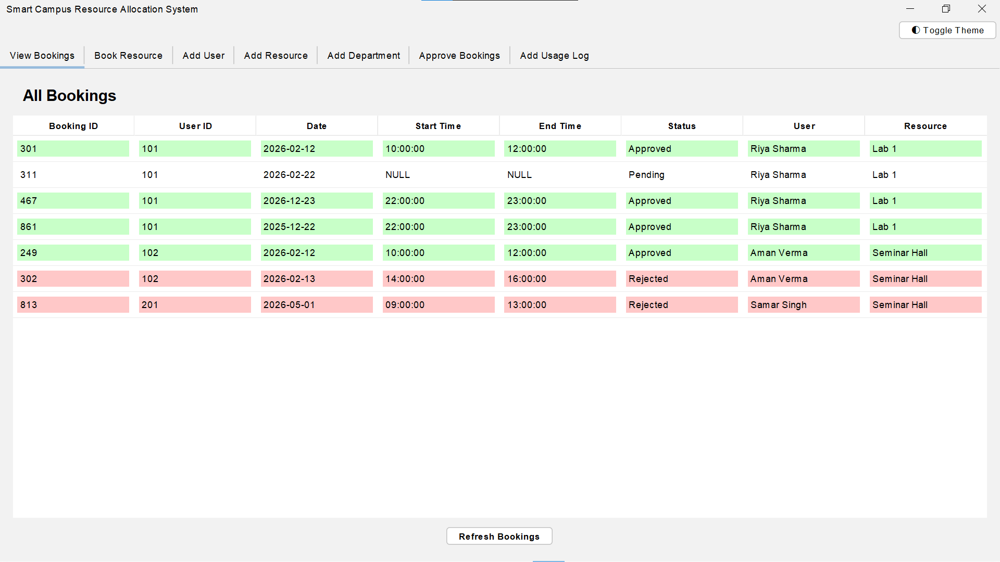
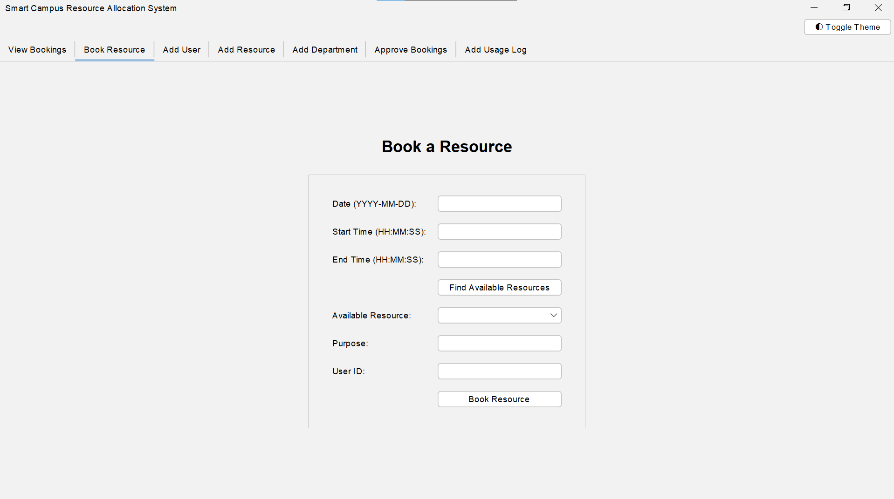
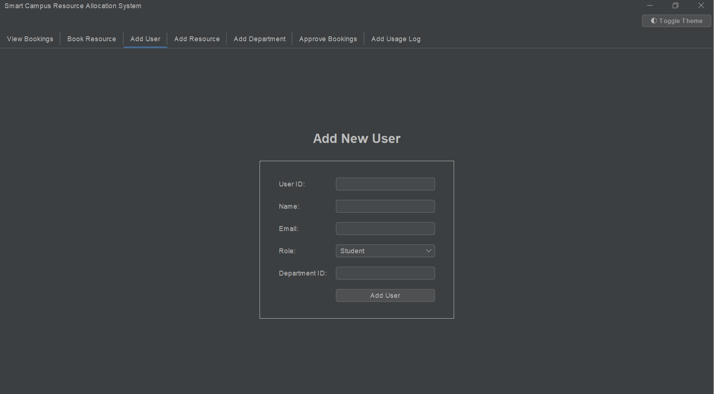
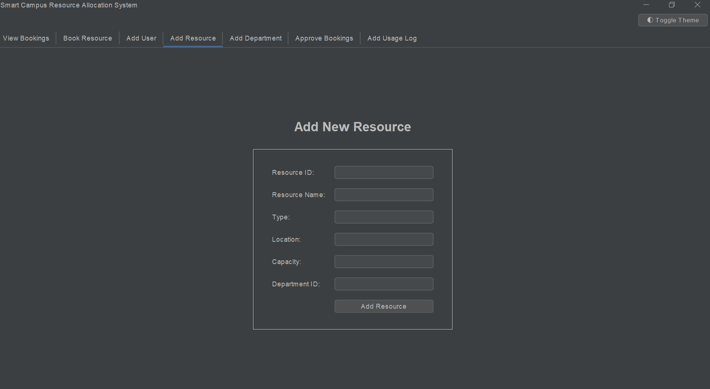
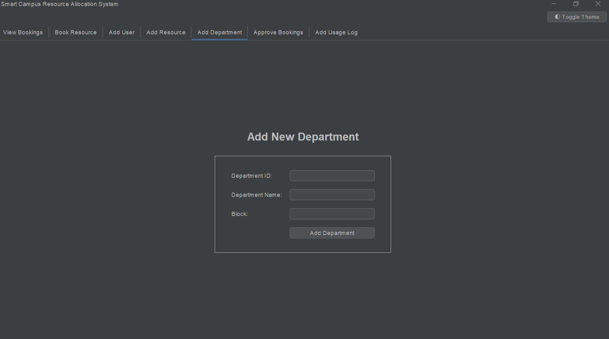
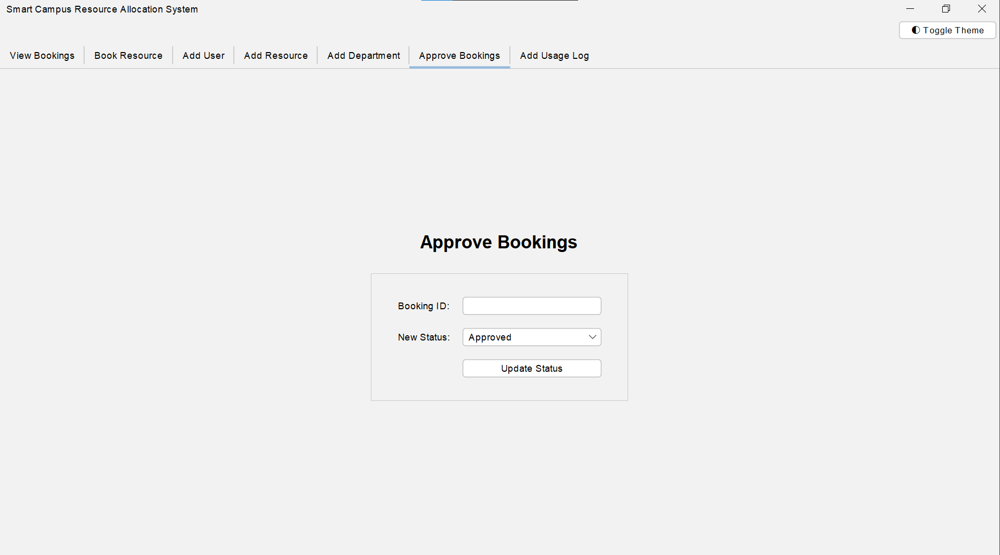
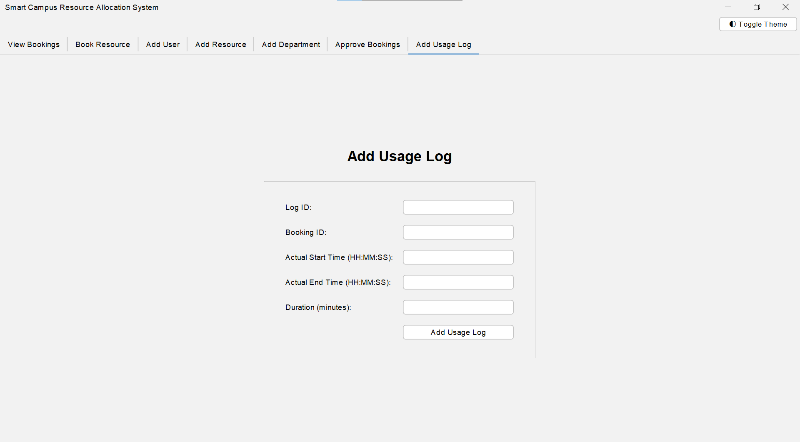

# Smart Campus Resource Allocation System

The *Smart Campus Resource Allocation System* is a Java-powered desktop application with an intuitive Graphical User Interface (GUI), purpose-built to manage and allocate campus resources — including classrooms, laboratories, seminar halls, and projectors — with precision and ease.

Inadequate scheduling in academic institutions often leads to booking conflicts and underutilized resources. This application addresses that gap by delivering a centralized, database-driven platform capable of dynamically managing users, resources, and bookings while maintaining a fully conflict-free scheduling environment

## Features

* **Dynamic Resource Booking:** Enter a date and time slot, and the system will automatically query the database to show you only the resources that are currently available.
* **View Bookings:** A comprehensive dashboard to view all past and upcoming bookings, including their approval status.
* **Manage Data:** Built-in forms to easily add new **Departments**, **Users**, and **Resources** to the campus network.
* **Approval Workflow (Password Protected):** A secure "Approve Bookings" tab allowing administrators to approve or reject pending resource requests. Accessing this tab requires the admin password (default: `root`).
* **Usage Logging:** Track actual resource usage, including actual start times, end times, and duration, through the "Usage Logs" tab.
* **Modern Interface:** A sleek, fully revamped Graphical User Interface utilizing the `FlatLaf` framework, complete with rounded components, improved typography, and generous layout spacing.
* **Dark/Light Theme Toggle:** Instantly switch the application between a modern Dark Mode and a clean Light Mode with a single click, completely uninterrupted.
* **Smart Color Rendering:** Dynamic, theme-aware table rows that automatically adjust contrast and text color to remain perfectly readable in both light and dark modes.

## Screenshots

<div align="center">
  
  <p><em>The main dashboard showing all bookings with color-coded statuses.</em></p>
</div>

<br>

<div align="center">
  
  <p><em>Dynamic resource booking form.</em></p>
</div>

<br>

<div align="center">
  
  <p><em>Form to add new users to the system.</em></p>
</div>

<br>

<div align="center">
  
  <p><em>Form to add new resources like classrooms and labs.</em></p>
</div>

<br>

<div align="center">
  
  <p><em>Form to register new departments.</em></p>
</div>

<br>

<div align="center">
  
  <p><em>Secure admin portal to approve or reject requests.</em></p>
</div>

<br>

<div align="center">
  
  <p><em>Track the actual usage times and durations for completed bookings.</em></p>
</div>

## Dependencies Required

To run this application, you must have the following installed on your system:

1. **Java Development Kit (JDK):** Version 21 or higher.
2. **MySQL Server:** Running locally on port `3306` with the username and password both set to `root`.
3. **MySQL JDBC Driver:** The `mysql-connector-j-8.0.33.jar` library is required to connect Java to MySQL. *(Note: This has already been downloaded and placed inside the `lib/` folder for you!)*

## Step-by-Step Guide: How to Run

Follow these instructions to start the application:

### Step 1: Database Setup
1. Ensure your local **MySQL Server** is running.
2. If you haven't already, create a database named `smartcampus`.
3. *(Optional)* If you are starting fresh, you can execute the contents of `schema.sql` inside your MySQL environment to automatically generate all the necessary tables and populate them with sample data.

### Step 2: Open Terminal
Open your Command Prompt or PowerShell and navigate to the project directory:
```bash
cd "e:\DBMS PROJECT"
```

### Step 3: Compile the Code
If you have made any changes to the source code, you will need to recompile the Java files into the `bin` directory. Run this command:
```bash
javac -cp "lib/mysql-connector-j-8.0.33.jar" -d bin src/main/java/com/smartcampus/*.java
```

### Step 4: Launch the Application
Run the following command to start the Java Swing GUI:
```bash
java -cp "bin;lib/mysql-connector-j-8.0.33.jar" com.smartcampus.Main
```

The graphical user interface will instantly pop up on your screen. Navigate through the tabs at the top to explore the different features!
